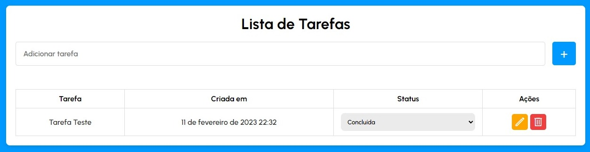

# Task List

## The project consists of a complete Full Stack application with the goal of assisting in the management of activities and tasks.

<br>
 

<br>
<br>
 
# Technologies Used

## Backend


- <a href="https://nodejs.org/en/"> NodeJS</a>
- <a href="https://expressjs.com/">Express</a>

## Frontend

- <a href="https://www.w3schools.com/html/">HTML</a>

- <a href="https://www.w3schools.com/css/">CSS</a>

- <a href="https://www.javascript.com/">JavaScript</a>

## Database

- <a href="https://www.mysql.com/">MySQL</a>

<br>

# How to Use

### First, we need to clone or download this repository.

```bash
#Command to clone the repository

$ git clone https://github.com/manualdodev/todolist-fullstack.git
```

### After cloning the repository, it is necessary to create a MySQL database along with the necessary columns.

```bash
#Command to create a database in the MySQL terminal:

$ CREATE DATABASE database_name;
```

### Next, it is necessary to create the "tasks" table that will be used by the application.


```bash
#Command to create the table with its columns

$ CREATE TABLE tasks(
    id INT PRIMARY KEY AUTO_INCREMENT,
    title VARCHAR(45) NOT NULL,
    status VARCHAR(45) NOT NULL,
    created_at VARCHAR(45) NOT NULL
);
```

### In the root of the project there will be a file named ".env.example" this file contains 5 fields that will have to be filled in a file named ".env", just create this file or rename the example file. After that, just fill in the fields with the data related to your database.

```bash
PORT= [Port the server will run on]
MYSQL_HOST= [The host of your machine, by default is 'localhost']
MYSQL_USER= [Your username, by default MySQL uses the 'root' user]
MYSQL_PASSWORD= [The password you chose when installing MySQL]
MYSQL_DB= [The name of the database created earlier.]
```

### Before starting the application, we need to install the 'node_modules' and to do this, simply open a terminal in the "backend" folder (it is advisable to use the terminal of the editor/IDE).

```bash
#Command to download the 'node_modules'

$ npm install
```

### Finally, just run the command to start the server (still inside the "backend" folder) and open the "index.html" file.

```bash
#Command to start the server.

$ npm start
```

<br>

# Credits to

### Manual do Dev

- <a href="https://github.com/manualdodev"> GitHub
- <a href="https://www.youtube.com/@ManualdoDev"> YouTube
- <a href="https://youtube.com/playlist?list=PLdtmpu_1ITQJ1Y2-ZBbE7ROP6u1kU0J5l">Playlist for this Project


